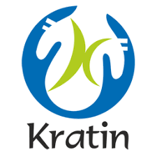

# Kratin
<!DOCTYPE html>
<html lang="en">
<head>
    <meta charset="UTF-8">
    <meta http-equiv="X-UA-Compatible" content="IE=edge">
    <meta name="viewport" content="width=device-width, initial-scale=1.0">
    <title>Document</title>
    <link rel="stylesheet" href="index.css">
</head>
<body>
    

    
Let's Innovate

    <h2 class="head">How can you help Sunita Sharma(65+ years
        old) to live a healthier and better life?</h2>

        

           

            
           
 
           

            <h5 style="font-weight:600; font-size: 18px;" >Identify one use case for elderly care (for the age group
                65+) and create a  working prototype to demonstrate
                your idea using technology known to you.
            </h5>
                <h2>Expected Efforts:2-3 days</h2>
           

        

        <h2>What we are looking for this in this activity ?
</h2>
        <section >

    
    

       <h4> Innovation & Ideation</h4>
    

    

    <h4>Coding Skills</h4> 
    

    
 <h4>Your magic touch</h4>

    

  

    

<ul class="arrow" style="list-style-type: lower-roman; color: cornflowerblue;">
    <li>Originality in idea</li>
    <li>Research Skill</li>
    <li>Value outcome</li>
</ul>
    

    

        <ul class="arrow" style="list-style-type: lower-roman; color: cornflowerblue;">
            <li>Logic</li>
            <li>Rapid Prototyping</li>
            <li>Coding Practice</li>
        </ul>
    

    

        <ul class="arrow" style="list-style-type: lower-roman; color: cornflowerblue;" >
            <li>Secert ingredient for going towards expertise.</li>
        </ul>
    

  

        </section>
</body>
</html>
